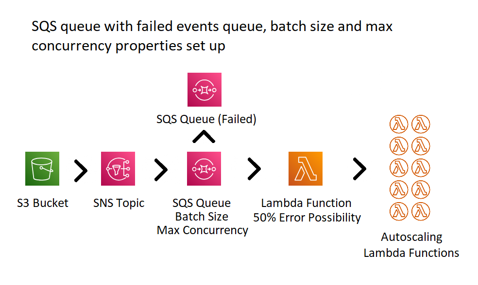

# AWS SNS SQS 2

File upload to S3 bucket using SNS topic, SQS queue (dead letter, maxConcurrency, batchSize) and lambda function.

The lambda function includes a boolean that has a 50% chance of failure. If the function fails, the message will be sent to the failed events queue.

## Useful commands

* `npm run build`   compile typescript to js
* `npm run watch`   watch for changes and compile
* `npm run test`    perform the jest unit tests
* `cdk deploy`      deploy this stack to your default AWS account/region
* `cdk diff`        compare deployed stack with current state
* `cdk synth`       emits the synthesized CloudFormation template

## Upload file to S3 bucket

`aws s3 cp example.txt s3://example-st-s3-bucket`

## AWS diagram

## Extra help for development

[CDK S3 Bucket already exists error](https://repost.aws/knowledge-center/cdk-already-exists-error)